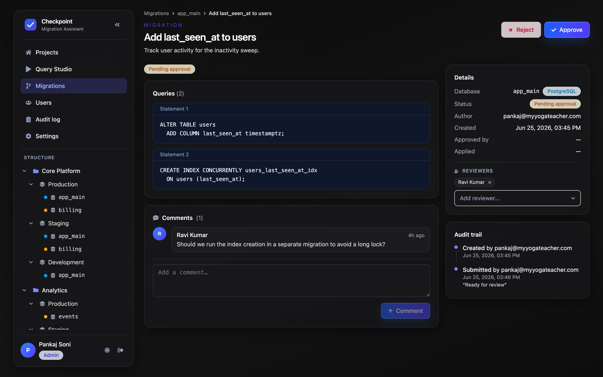
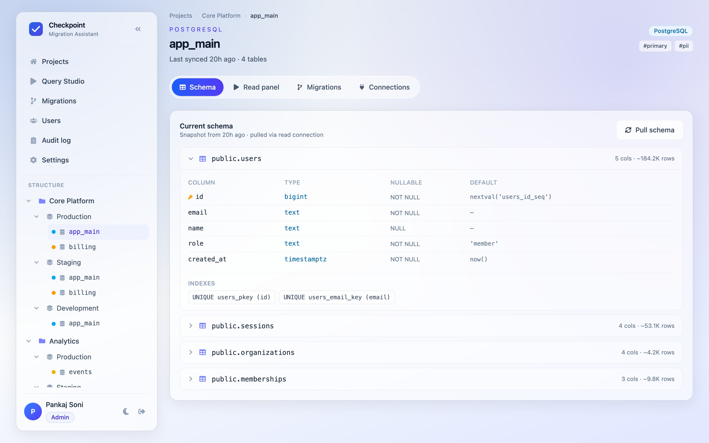

# Checkpoint

A database migration assistant. Propose schema changes as reviewable migrations,
get them approved, apply them through a controlled write connection, and keep a
full audit trail. Browse live schema and run read-only queries against your
databases — all behind Google sign-in with role-based access.

> **Status:** Full stack wired end-to-end. The **frontend** (React) talks
> directly to the **backend** (Bun + TypeScript + MySQL) under
> [`server/`](server) over `fetch` with a session cookie — there is no mock
> layer. Sign-in uses **Google Identity Services**: the client renders the
> Google button, gets an ID token, and posts it to `POST /api/auth/google`,
> which the server verifies before creating the session. Set
> `VITE_GOOGLE_CLIENT_ID` (client) and `GOOGLE_CLIENT_ID` (server) to the same
> OAuth client.

## Screenshots

| Projects | Migration review |
| --- | --- |
|  |  |

| Schema browser | Query Studio (read panel) |
| --- | --- |
|  |  |

## Stack

- **Frontend:** React 19, TypeScript, Tailwind CSS v4, React Router 7, Vite
- **Notifications:** react-hot-toast (custom-themed)
- **Backend:** Bun + TypeScript, MySQL (`mysql2`), cookie sessions, Google ID-token verification (`google-auth-library`)
- **Deployment:** Docker (multi-stage) + docker-compose (app + MySQL)

## Core concepts

```
Project ─┬─ Environment (production / staging / development) ─┬─ Database
         │                                                    │   ├─ read connection   (schema pulls, read panel)
         │                                                    │   └─ write connection  (apply migrations)
```

A **migration** targets one database, carries one or more ordered SQL statements,
and moves through a lifecycle: `draft → pending_approval → approved → applied`
(or `rejected` / `failed`). Reviewers and threaded comments support the review.

## Features

1. **Google login** with role-based access (`admin` / `editor` / `viewer`).
2. **Structure tree** — Project → Environment → Database in a collapsible sidebar.
3. **Multi-engine** — PostgreSQL, MySQL, ClickHouse.
4. **Schema browser** — tables, columns, types, indexes, row estimates.
5. **Pull schema** — sync current structure from the database (read connection).
6. **Query Studio / read panel** — SELECT-only queries; results as a table or
   MySQL `\G`-style vertical view.
7. **Migrations** — multi-statement, create → submit → approve → apply, with
   reviewers, comments, and a per-migration audit trail.
8. **Read & write connections** per database.
9. **User management** — invite users, assign roles.
10. **Audit log** — system-wide, filterable record of actions.
11. **Settings** — email (SMTP) + Slack notification configuration (tabbed).
12. **UX** — dark mode, responsive mobile drawer, breadcrumbs, toasts.

See [`docs/features.md`](docs/features.md) for the full feature + data-model +
API specification used to plan the backend.

## Roles

| Capability                          | viewer | editor | admin |
| ----------------------------------- | :----: | :----: | :---: |
| Browse schema, run read queries     |   ✓    |   ✓    |   ✓   |
| Pull schema, create/submit migration|        |   ✓    |   ✓   |
| Add reviewers, comment              |        |   ✓    |   ✓   |
| Approve / reject / apply migration  |        |        |   ✓   |
| Manage users, write connections, settings |  |        |   ✓   |

## Develop

```bash
bun install
bun run dev          # client (:3000) + stub server (:3001)
bun run typecheck
bun run build
bun run lint
```

`bun run dev` starts the client (:3000) and the backend (:3001); the Vite dev
server proxies `/api` to the backend. Sign-in needs a real Google OAuth client
(`VITE_GOOGLE_CLIENT_ID` / `GOOGLE_CLIENT_ID`) and a running MySQL — the first
Google account to sign in is bootstrapped as `admin`.

## Deploy

```bash
cp .env.example .env   # fill in Google OAuth + metadata DB
docker compose -f docker-compose.example.yml up --build
```

## Project layout

```
src/
  types.ts              domain model (the API contract in TS)
  services/
    api.ts              client; fetch wrapper over the backend API
  context/              AuthContext, ThemeContext
  lib/                  format helpers, toast
  components/           Layout, StructureTree, Dropdown, ui primitives, …
  pages/                one file per screen
server/
  index.ts              entry: Bun.serve, route registration, SPA static serving
  env.ts                env config (DB, session, Google, locked org)
  db/                   MySQL pool, schema.sql, idempotent init
  lib/                  http router, session, google verify, crypto, audit, auth
  modules/              one file per domain (auth, projects, migrations, …)
docs/features.md        feature + data model + API spec
```

## Backend (Bun + MySQL)

A structured server under [`server/`](server): a tiny path-param router, cookie
sessions backed by a `sessions` table, **Google ID-token verification** (the
client signs in with Google and POSTs the credential to `/api/auth/google`),
RBAC enforced server-side, encrypted connection secrets, and an append-only
audit log. The schema is applied idempotently on boot from
[`server/db/schema.sql`](server/db/schema.sql).

```bash
# needs a MySQL 8 running and APP_DATABASE_URL (or DB_* / GOOGLE_CLIENT_ID) set
bun run dev:server      # API + SPA on :3001 (watch mode)
bun run typecheck:server
```

Schema introspection, read queries, and migration apply connect to the managed
(external) databases — implemented today for **MySQL-family** engines via
`mysql2`; other engines return `501` until their drivers are added.

> **First sign-in** bootstraps an admin (the first Google account). After that,
> users must be invited. With `VITE_ORG` set, everyone joins that single org.

## Related docs

- [`AGENTS.md`](AGENTS.md) — conventions for AI agents / contributors.
- [`docs/features.md`](docs/features.md) — backend planning spec.
